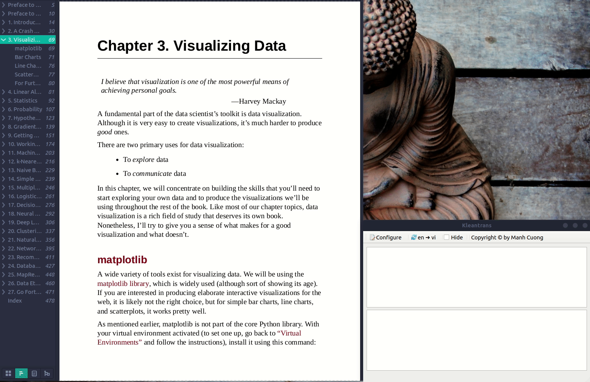

# KleanTrans 

_KleanTrans is an open-source application with a clean and simple interface for translating text using PyQT6._


## Overview
- KleanTrans helps you to clean up the text before translating it, such as remove extra spaces, newlines, and special characters.
- KleanTrans supports translating text from English to Vietnamese and vice versa.
- Do not need to copy and paste the text to the translation tool, just select the text and press `Ctrl + CMD` or **Middle Mouse** to translate the text.

## Pre-requisites

| # | OS               | Python Version | Pass |
|---|------------------|----------------|------|
| 1 | Ubuntu 22.04 LTS | `3.11.x`       | ✅    |
| 2 | Ubuntu 24.04 LTS | `3.12.x`       | ✅    |

- Install the dependencies Ubuntu packages:
  ```bash
  sudo apt update &&
  sudo apt install -y translate-shell xclip libxcb-cursor-dev --upgrade
  ```

- Install required Python packages:
  ```bash
  # Ubuntu 23.04 or higher, Python 3.12 or higher
  pip3 install -r requirements.txt --upgrade --break-system-packages
  
  # Remaining cases
  pip3 install -r requirements.txt --upgrade
  ```

- Install `kleantrans`:
  ```bash
  # Ubuntu 23.04 or higher, Python 3.12 or higher
  pip3 install kleantrans --upgrade --break-system-packages
  
  # Remaining cases
  pip3 install kleantrans --upgrade
  ```

## Demonstration



## Usage:
- Run the application:
  ```bash
  kleantrans
  ```
- Currently, I only support the following languages:
  - English
  - Vietnamese

- To translate text, using mouse to select the text and press `Ctrl + CMD` _(**Window key** on the Windows OS)_ or **Middle Mouse** to translate the text.

- To **SHOW**/**HIDE** the application, press `SHIFT + CMD`.